# AIR POLLUTION IN MILWAUKEE COUNTY

Summary: Air quality directly impacts your health. Reducing pollution exposure is the best way to protect yourself and your loved ones.

> [!Navigation]  
> **Air Pollutants**  **Our Health**  **Regulation**  **What You Can Do** <!--These correspond to H1 headings-->
 
Description: Health risks from air pollutants can change based on who you are, where you live, and your existing health conditions. Exposure to different pollutants is associated with increases in risk to different health conditions, most of which affect the respiratory system. Industrial plants, construction projects, and road traffic are major point sources of air pollution. Knowing your exposure risks and and how to reduce and prevent pollution exposure is the best thing you can do for the health of yourself and your loved ones.

# Air Pollutants

Clean air is critical to good health. Air quality is determined by the amount of air pollutants in the atmosphere, and changes frequently--not only every day but sometimes every hour. Certain pollutants, known as criteria pollutants, are measured, reported, and monitored on the national scale. There are only six criteria pollutants and hundreds of other hazardous air pollutants. What’s in the air we breathe is affected by our geography, the time of year, and proximity to pollution source points. 

## Point Source and Nonpoint Source Pollution

A rush of wheels and the blare of horns on the highway at rush hour, a garbage truck hitting a bump in the road, smokestacks billowing over the river, and the crashing sound of a pile driver. Point sources of pollution can be seen or heard, but its effects are often invisible and not felt immediately.

There are two main types of pollution sources: point sources and nonpoint sources. Point sources are single, stationary places, like smokestacks. Nonpoint sources are everything that can’t be attributed to a single source. Traffic emissions are a result of many vehicles. Wildfire smoke comes from hundreds or thousands of miles away on the air. Because nonpoint pollution can’t be pinpointed to one source, it is much more difficult to control or regulate than point source pollution.

Pollutants can be emitted from either point or nonpoint sources. Living or working point or nonpoint polution sources can increase your risk of exposure to certain pollutants. 

## Criteria Air Pollutants

Six air pollutants are regulated by the EPA under the National Ambient Air Quality Standard to protect environmental and public health. The six criteria air pollutants are sulfur dioxide, lead, carbon monoxide, nitrogen dioxide, particulate matters, and ozone.  The three most common in urban areas are particulate matter, ozone and nitrogen dioxide.

### Particulate Matter (PM)

- Point Source
- Nonpoint Source

Particulate matter is measured in micrometers, the two types of particulate matter, PM10 and PM2.5, are named for their size in micrometers. Both are invisible to the human eye. 

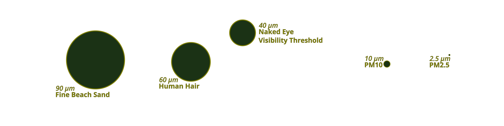 

### Diesel Particulate Matter (DPM)

- Non Point Source

Diesel Particulate Matter (DPM) is a type of particle pollution made up of heavy metals and carbon. Diesel particle pollution is sometimes called black carbon or soot. DPM traps heat in the atmosphere, and can deposit on land and water. Diesel particle pollution’s composition makes it particularly dangerous.The International Agency for Cancer Research classifies diesel particle pollution as a known carcinogen. 

### Ground Level Ozone (O3)

- Point Source
- Nonpoint Source

Ground-level ozone (O3), known as smog, is formed by the reaction between sunlight and two pollutant classes, volatile organic compounds and nitrogen oxides. As the weather heats up during the summer months, O3 increases as pollutants react to heat and sunlight and chemical reactions speed up. Volatile organic compounds are released as vaporous fumes from everyday chemicals like gasoline, paint, pesticides, and solvents. 

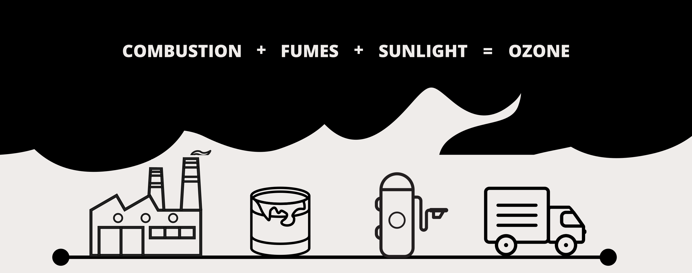

### Nitrogen Dioxide (NO2)

- Non Point Source

Nitrogen oxides are combustion byproducts, primarily released from vehicle emissions. Nitrogen dioxide is a contributor to ground-level ozone and  tends to be highest near heavily traveled roadways. In the home, appliances such as stoves, dryers and space heaters that run on gas can produce unhealthy amounts of NO2 if appliances are not properly vented outdoors. 

[Air Quality Data Map](https://strummonk.github.io/cap-map/docs/)
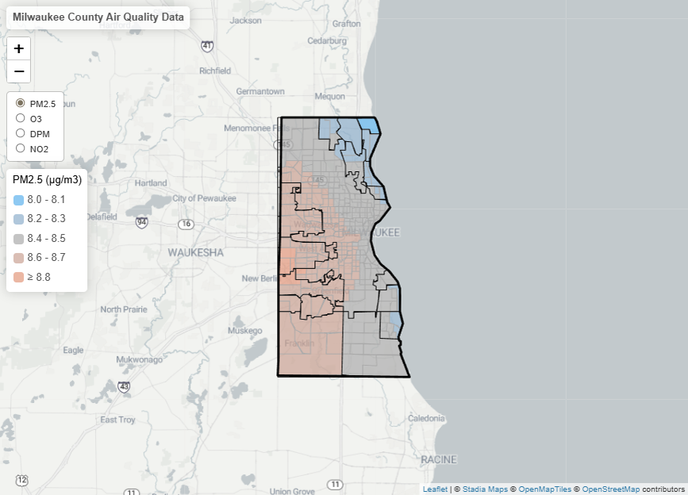 

Each pollutant has its own regulatory standard and monitoring period. For example,  PM2.5 and PM10 are reported every twenty-four hours, and the regulatory standard for each is 35ug/m3. Ozone levels are reported every eight hours, and the regulatory standard is 70ppb (parts per billion).

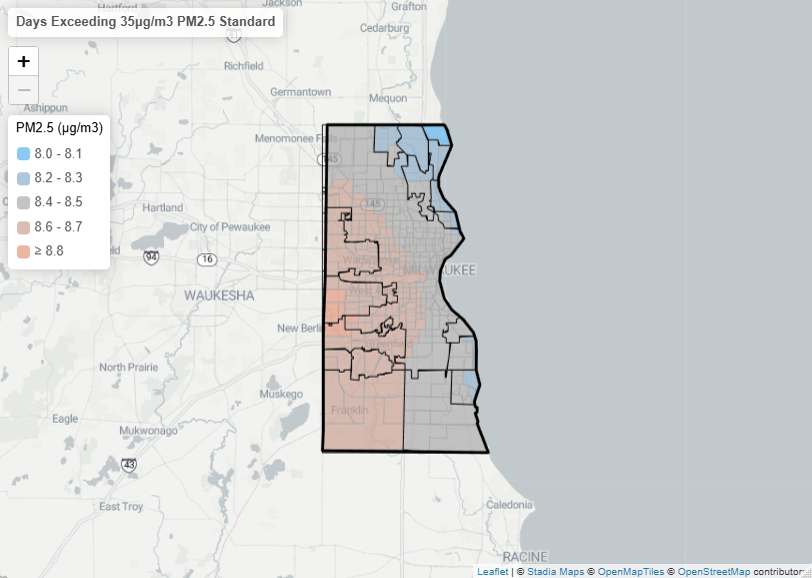
[PM2.5 Map](https://strummonk.github.io/cap-pm/docs/)

The highest annual average for PM2.5 is centered around the Root River Parkway, just north of the Hale Interchange. PM2.5 levels however is fairly consistent across the county, and never exceed the annual standard.

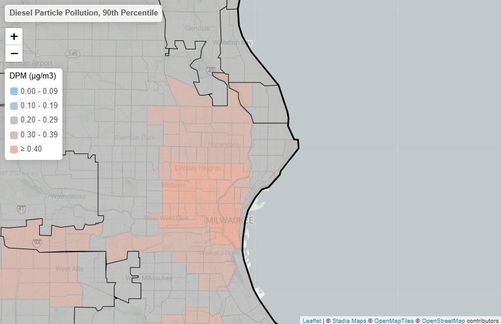  
[DPM Detail Map](https://strummonk.github.io/cap-dpm/docs/) 

Diesel particle pollution is emitted from the combustion of diesel fuel. Passenger vehicles, construction equipment, buses, and trucks can all be contributors. In the City of Milwaukee, diesel particle pollution levels  are highly concentrated at the Lake, Marquette and Hillside Interchanges.

[Map Ozone Layer Only](https://strummonk.github.io/cap-ozone/docs/)
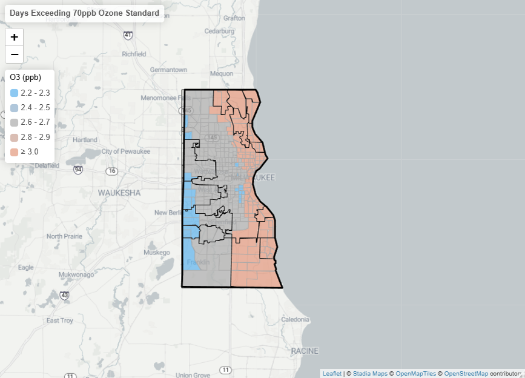

In Milwaukee County, high ozone level days tend to be greatest along Lake Michigan. Ozone levels typically rise when temperature is warm.  We’re most likely to see high ozone level days during the hottest months of the year, between May and September.

[Map DPM only](https://strummonk.github.io/cap-dpm-full/docs/)  
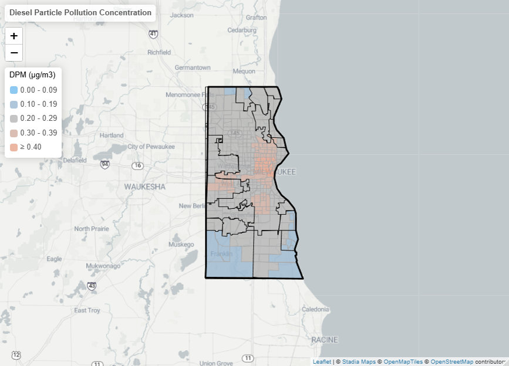

Vehicle emissions are the greatest sector for pollution emissions in Wisconsin. Fuel Evaporation and combustion releases volatile organic compounds, nitrogen dioxide and diesel particle pollution. Vehicle and equipment emissions are considered mobile source pollution.

[Top census tracts](https://strummonk.github.io/cap-toptracts/docs/)   <!-- map shows NO2 -->
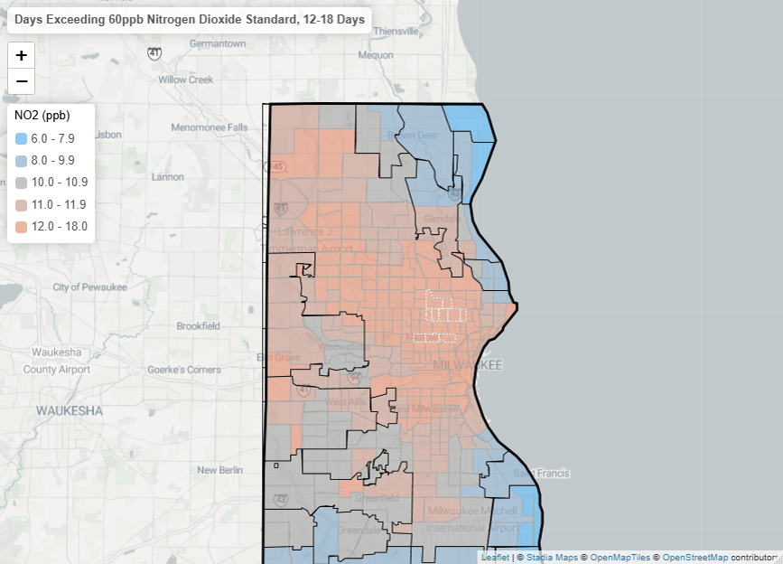

Wind currents from Lake Michigan push air inland, and pressure and temperature changes trap polluted air close to the ground. Census tracts with the highest average reported pollution levels are clustered inland around I-43 at Locust St and west along Lisbon Ave in the Harambee, Lindsay Heights, Midtown and Old Bronzeville neighborhoods. Nitrogen dioxide levels in these tracts are particularly high. 

## Hazardous Air Pollutants

Both criteria air pollutants and hazardous air pollutants, or air toxics, make up the air we breathe. Exposure to air toxics comes from breathing contaminated air, ingesting contaminated water or fish, and through skin contact with contaminated soil, dust or water. There are over 100 pollutants classified as air toxics. These pollutants originate from outdoor sources like vehicles, and indoor sources like building materials and cleaning products. Primary emitters of air toxics are coal-fired power plants and factory smokestacks. Hazardous air pollutant emissions are reported by emitting facilities, but they are not regulated under national air quality standards.

> [!Embed]  
> [Clean WI](https://www.cleanwisconsin.org/hazardous-air-pollutants-environmental-justice-in-wisconsin/)  
> Title: Hazardous Air Pollutants & Environmental Justice in Wisconsin  
> Subtitle: Click the link to read Clean Wisconsin's health brief about HAPs.  

Hazardous air pollutants are known or suspected to cause cancer, birth defects, and damage to the immune, reproductive and respiratory systems. Mercury is a toxic air pollutant often found in contaminated fish and released from burning coal. Mercury never leaves the body once ingested or inhaled.  Other air toxics to be aware of include asbestos, formaldehyde, and lead compounds.

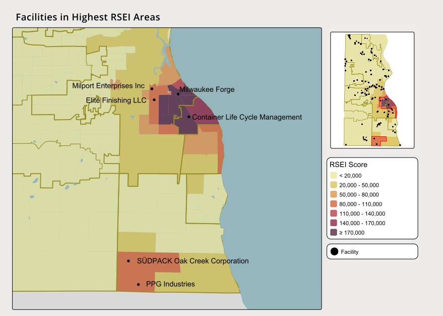

The EPA's Risk Screening Environmental Indicators (RSEI) is a tool for estimating potential pollution levels. The RSEI evaluates HAPs from facility emissions and considers the pollutants' emission size, relative toxicity, transportation and lifecycle, as well as the size of potentially exposed populations. RSEI scores to do not estimate risk, but are a way to begin identifying areas of concern for pollution impacts. St Francis, Oak Creek and the City of Milwaukee neighborhoods of Polonia and Bayview show the highest RSEI scores in the county. Six industrial facilities are sited in the high-score areas. The EPA's Toxic Release Inventory lists the criteria air pollutants PM2.5, PM10, sulfur dioxide and carbon monoxide as the most commonly emitted criteria air pollutants, and elemental carbon, nickel and ammonia as the most commonly emitted HAPs. Ammonia contributes to smog. The National Cancer Institute lists nickel as a risk factor in nasal and lung cancer. Elemental carbon is a foundational component of diesel particulate matter. 

- - -

There are two main types of air pollutants. Criteria air pollutants and hazardous air pollutants. Criteria air pollutants like particulate matter, ground-level ozone and nitrogen dioxide are reported by major cities and are nationally regulated. Hazardous air pollutants, or air toxics, are not nationally regulated but are reported by emitting facilities. Both types of pollutants can come from stationary sources, like factories, called point sources, or from mobile sources, like vehicles. Exposure to pollutants in Milwaukee County is based on geography, temperature, weather, and your proximity to pollution sources.

# Regulation

Air quality regulations safeguard environmental and human health. Air quality standards have increased and pollution levels have decreased over the decades, but public health groups argue more needs to be done. 

## Safer Standards

A standard does not necessarily mean a healthy limit. In 2015, organizations like the American Lung Association , the American Academy of Pediatrics and Medical Advocates for Healthy Air advocated for stricter standards for ground level ozone. The national regulatory standard for unhealthy ozone levels in the atmosphere is 70 parts per billion (ppb). The maps below compare the current standard to the proposed standard of 60ppb. Advocates argued that health effects from ozone pollution are impactful at levels below the current standard. 

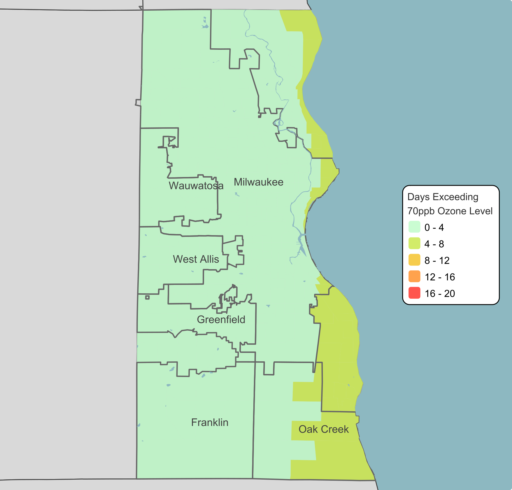
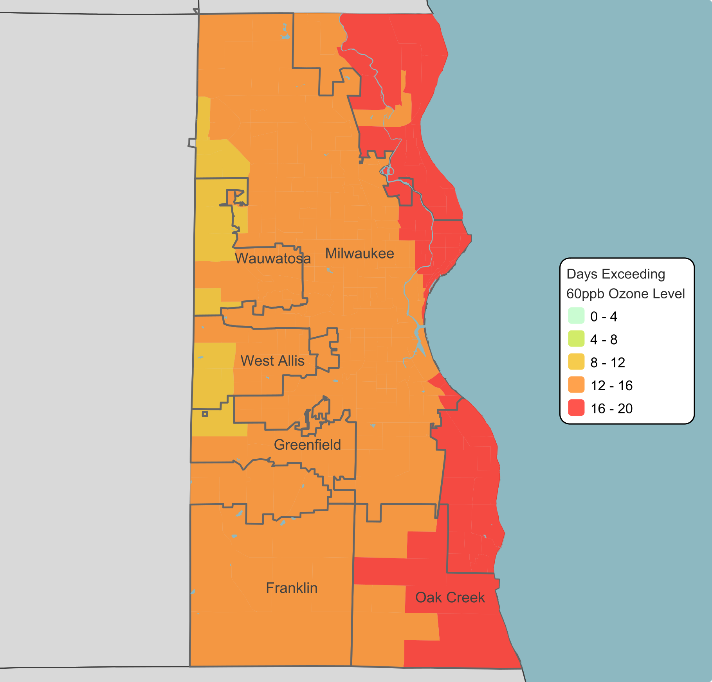

The map of the 70ppb standard shows ozone reached unhealthy levels relatively infrequently. At most, ozone is at unhealthy levels an average of eight days over a three year period. When the 60ppb standard is used, daily ozone concentrations reaches unhealthy levels twice as many days or more over the same period. Both maps show proximity to Lake Michigan increases the likelihood of days with high ozone concentration.  
Under the proposed 60ppb standard, air quality for sensitive populations would be considered unhealthy at a lower level on the Air Quality Index than the current standard. Reducing exposure risk is about prevention, and a lower standard would allow everyone to make more informed decisions about their exposure risk. Still, the best way to reduce exposure risk is to clean the air. 

## Reducing Emissions

Pollutants released from vehicles are referred to as tailpipe emissions. In July of 2026 the State of Wisconsin introduced the Clean Fleet Policy. Under the Clean Fleet Policy, the state is required to purchase electric for new light-duty government vehicles. Electric vehicles have the benefit of zero tailpipe emissions. The Clean Fleet Policy seeks to decrease tailpipe emissions by increasing the amount of electric vehicles on the road.

Light duty vehicles make up the greatest share of daily vehicle miles, traveling  an average of 700,339 miles a day on Milwaukee County roads. Light-duty vehicles includes passenger vehicles, motorcycles, buses, and commercial trucks. Your commute to work is more than likely done in a light duty vehicle. 

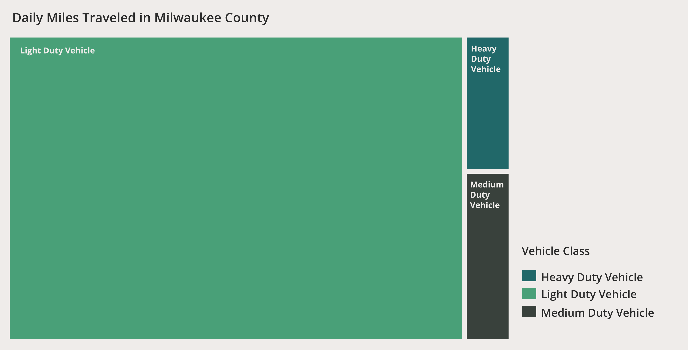

More light duty electric vehicles on the road would reduce tailpipe emissions. However, despite making up the smallest share of daily miles traveled, heavy duty vehicles are the greatest emitters of tailpipe emissions on the road. In Milwaukee County, heavy duty vehicles travel an average of 31,631 miles a day, but are responsible for 54.8% of on-road emissions. Particle, nitrogen dioxide, and volatile organic compounds pollution are byproducts of combustion engines. Nitrogen dioxides and volatile organic compounds react with sunlight to form ground-level ozone, or smog. Particle pollution includes carcinogenic diesel particle pollution

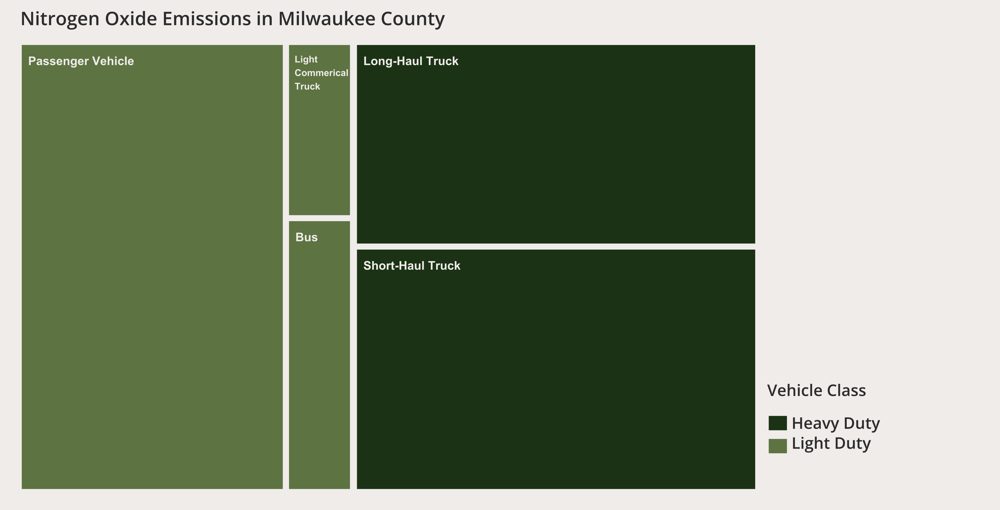

[Heavy Duty Vehicle Miles Traveled Interactive Map](https://strummonk.github.io/vmt-hdv-mke/docs/)
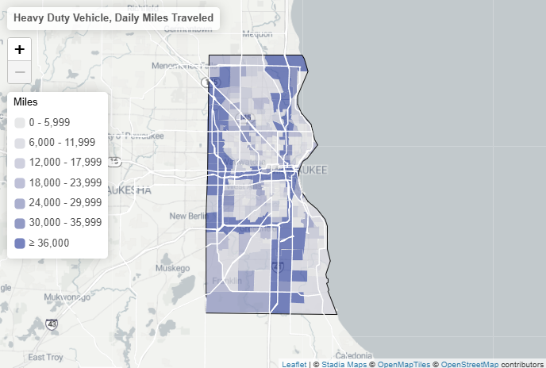

Exposure to tailpipe emissions is greatest in areas where distance traveled is greatest. Traffic emissions have a pose the most risk to those living near major highways and interstates. In Milwaukee County, heavy duty vehicles miles traveled is highest around I-43 and I-94, the Zoo Freeway and I-894.

Traffic pollution poses a disproportionate burden on people of color and low-income communities Lindsay Heights, Midtown, Walker's Point and Oak Creek all sit in highest areas for heavy duty vehicle miles traveled.

Exposure risk is a multi-layered issues involving pollutant concentration, government regulation, emission sources and proximity to source points. Proximity to point source and mobile pollutant sources can increase your risk of exposure. Steps are being taken by the government to regulate and reduce pollution, but some groups believe it may not be enough. Individually, it's the small things that can make a big impact. Being aware of the exposure risks and how to prevent is the first step to reducing the harmful effects from air pollution. 

# Our Health

Both criteria air pollutants and hazardous air pollutants are in the air we breathe everyday. Wildfire smoke, living or working near factories or highways increases your exposure to air pollution. Certain demographics are also more at risk of health impacts that others. 

[Asthma Interactive Map](https://strummonk.github.io/health-asthma-mke/docs/)  
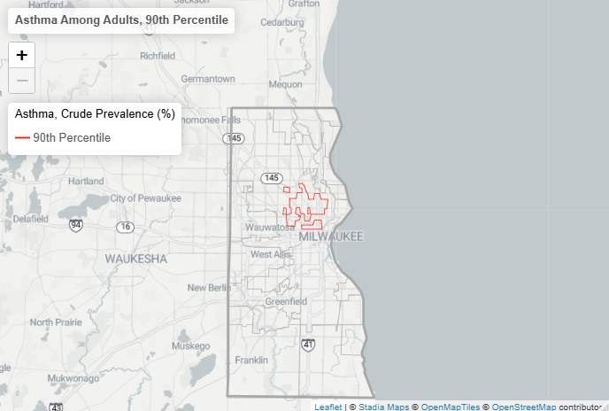

According to the Wisconsin Asthma Coalition, 1 in 11 adults and 1 in 12 children have asthma. In 2018, of those who died of asthma, 39% were 65 and older. Over a quarter of adults reported that they were unable to work due to their asthma in the same year. Over half of employed Wisconsin adults with asthma reported that their asthma was caused, or made worse by, exposures at work. 

[Race and Asthma Interactive Map](https://strummonk.github.io/health-asthma-race-mke/docs/)  
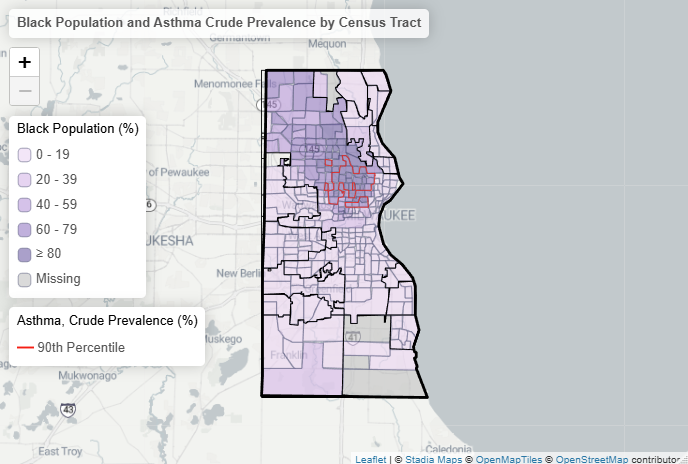

In Milwaukee, asthma rates for the entire county are most prevalent in the predominantly black Milwaukee neighborhoods of Lindsay Heights, Granville, Amani and Franklin Heights. Black children are the most likely group to be hospitalized due to asthma. There is no cure for asthma, but it can be controlled by avoiding the triggers that can cause an attack, such as mold, smoke, and pollution.

[COPD Interactive Map](https://strummonk.github.io/health-copd-mke/docs/)  
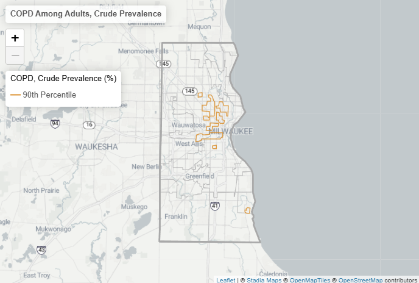

Older adults are less able to endure the effects of air pollution. Poor air quality from smog, traffic congestion and wildfire smoke worsens the impacts of lung diseases, such as COPD, leading to increased hospitalization and emergency room visits. In 2023, Milwaukee County had 58.92 COPD related emergency room visits per 10,000 residents, a 33.7% increase over the state average. 

[COPD and aged 65 and over Interactive Map](https://strummonk.github.io/health-copd-age-mke/docs/)  
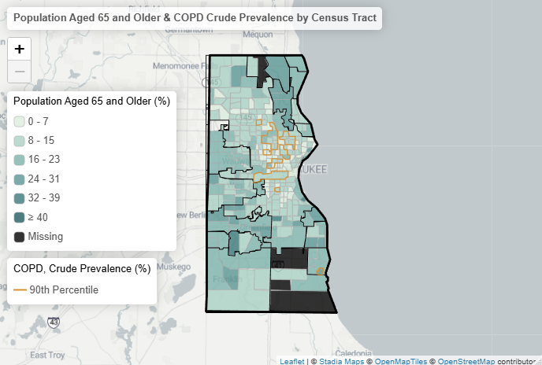

Statewide, women are more likely than men to go the emergency room or be hospitalized for COPD. Wisconsin also has an aging population, The U.S. Census Bureau estimates that nearly 26 percent of Wisconsin’s population will be 60 and older by the year 2030, or about 1.3 million people.

[CHD Interactive Map](https://strummonk.github.io/health-ch-mke/docs/)  
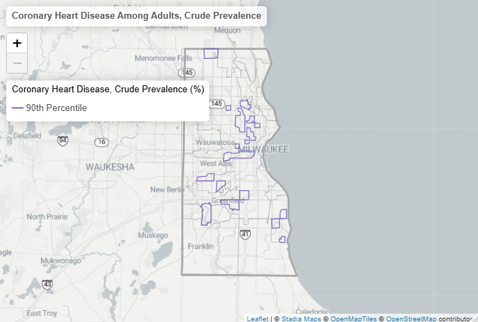

Heart disease is the leading cause of death in Milwaukee County. Air pollution, particularly for PM2.5 can increase the risk of cardiovascular events. The EPA finds public health impacts from short and long-term PM2.5 exposure leads to an increase in hospitalizations for serious cardiovascular events such as coronary syndrome, arrhythmia, heart failure, stroke, and sudden cardiac death, particularly in people with established heart disease. 

[CHD and ADI Score Interactive Map](https://strummonk.github.io/health-ch-adi-mke/docs/)  
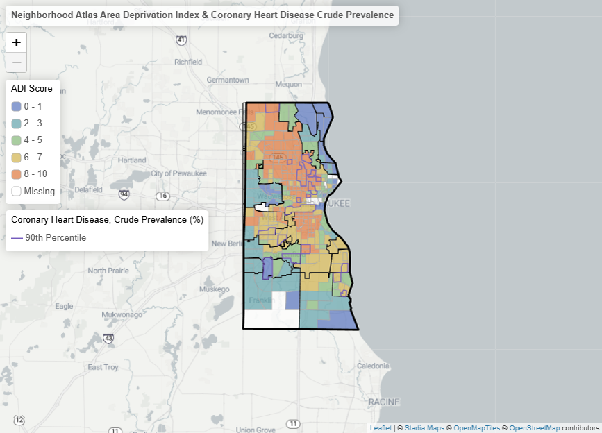

Exposure to fine particulate matter can cause heart palpitations, unusual fatigue, lightheadedness, shortness of breath, and chest, neck or shoulder pain. Air pollution levels are typically high near pollution sources like industrial areas and busy roadways, but people of color, older adults, and those of low socioeconomic status have increased risk of air pollution exposure. 

Health outcomes are compounded by lifestyle factors such as smoking, excessive drinking, obesity, age, and physical activity, although air pollution can worsen symptoms of asthma, heart, and lung disease. Air pollutant levels can be considered an environmental risk factor to health. Understanding air quality standards and when to reduce your exposure to high air pollutant levels is a way to positively impact your health.

# What You Can Do

Everyone can take action for better health. Being aware of daily air quality and reducing your exposure to air pollutants protects your neighbors, yourself and your loved ones.

## Air Quality Index
Checking air quality conditions is s simple as checking the weather forecast. Air quality is measured using the Air Quality Index (AQI), a color coded scale that reports levels of criteria air pollutants by zip code. The higher the AQI value, the greater the level of air pollution, and the greater the health concern. AQI values at or below 100 are considered satisfactory. AQI values above 100 are considered unhealthy. Children, older adults, and those with health conditions are at a greater risk at lower levels of the scale.

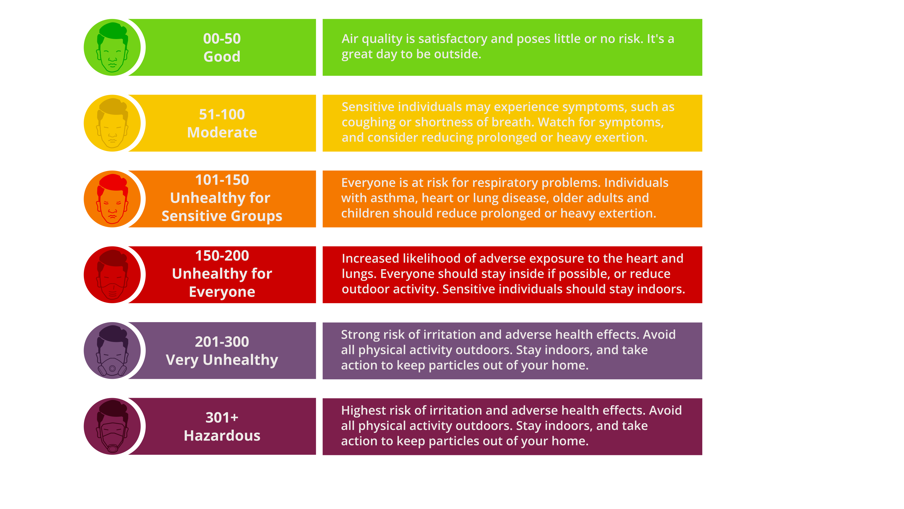

> [!Embed]  
> [AirNow](https://www.airnow.gov/?)  
> Title: EPA’s AirNow  
> Subtitle: Make checking the AQI a daily habit. The EPA’s AirNow, available by web and app, reports air quality levels by zip code.  

## Minimize Exposure

When air quality is at unhealthy levels, your chances of being affected increase the longer you are active outdoors and the more intense your activity. Reducing your time outdoors is the best way to protect yourself from harmful air pollution levels.

### Individuals

- When AQI levels are high, keep windows and doors closed and turn on an HVAC system with an air filter, or use a portable air filter if available. Poor air quality can worsen health conditions for older adults and those with existing health conditions.

### Caregivers
- Kids and teens are at at the greatest risk to exposure from air pollution. Children are more likely than adults to be active outside, and pollutant exposure at young ages can lead to long-term health impacts. Watch for symptoms in children such as coughing or difficulty breathing when the AQI is high. Plan for alternative indoor activities when AQI is high, or lower intensity outdoor activities. 

### Outdoor Workers

- Long work schedules and physical demands of work performed—resulting in higher breathing rates—may impact exposure or worsen the health effects of that exposure. Employers should have a plan in place to protect workers from air pollution from wildfires and other sources by preventing or minimizing exposure to hazardous air quality. Minimize exposure with frequent rest breaks indoors, wearing PPE when working in heavy smoke conditions, and allowing for flexibility and rescheduling work for days with better air quality.

Check the air quality index daily to make informed decisions about your risk of air pollution exposure. Air quality values over 100 are considered unhealthy, and protective steps should be taken to reduce your risk of exposure. When air pollution levels are high, prolonged time outside and strenuous activity should be reduced or avoided to protect your health. 

## Take Action

Individual action leads to collective change. You can take small steps in your community to improve air quality. 

- Plant trees and vegetation to help filter the air.
- Reduce or eliminate idling in vehicles.
- Consider buying electric when upgrading equipment and appliances. Electric lawnmowers, chainsaws and snowblowers are on the market. Electric indoor appliances can also reduce air pollution within the home.
- Biking, walking, taking public transit and carpooling once or twice a week can reduce traffic congestion and pollution.

Clean air is critical to good health. Informed choices are an important step to protecting your health and the health of your loved ones. Check the Air Quality Index, limit your exposure when pollution levels are high, and take simple steps to reduce emissions, such as walking, biking, carpooling, or using public transit when possible. Individual actions, combined with stronger government policies, can improve air quality and protect the health of everyone in Milwaukee County.

References
- https://www.lung.org/media/press-releases/ala-statement-ozone-standards-and-health-oct12015
- https://aq.aclima.io/ca/bassett-avocado/hyperlocal-data-hexbins
- https://democrats-science.house.gov/imo/media/doc/Minority%20Staff%20Ozone%20Comments%20Compilation%20-%20Final.pdf
- https://www.epa.gov/criteria-air-pollutants
- https://www.epa.gov/ozone-pollution-and-your-patients-health/what-ozone
- https://www.cleanwisconsin.org/wp-content/uploads/2026/05/Hazardous-Air-Pollutants_FINAL.pdf
- https://content.govdelivery.com/attachments/WIGOV/2026/07/15/file_attachments/3715876/CleanFleetPolicy.pdf
- https://www.sciencedirect.com/science/article/pii/S1226798824052590 
- https://www.airnow.gov/aqi/aqi-basics/
- https://www.dhs.wisconsin.gov/climate/aqi-outdoor-activity.htm
- https://dieselnet.com/tech/dpm_size.php#new_eng
- https://pubmed.ncbi.nlm.nih.gov/8793451/
- https://ozonewatch.gsfc.nasa.gov/facts/SH.html
- Lake Effects on AIr Pollution Dispersion.pdf
- aqi-technical-assitanc-document-sept2018
- https://www.lung.org/clean-air/outdoors/what-makes-air-unhealthy/nitrogen-dioxide
- https://www.chawisconsin.org/?wpdmdl=1821&ind=1604686177411
- https://acl.gov/sites/default/files/programs/2016-11/Wisconsin%20Epi%20Profile%20Final.pdf
- https://wisconsinwatch.org/2026/03/wisconsin-population-age-older-than-national-average-demographic-baby-boomer/
- https://www.dhs.wisconsin.gov/climate/aqi-outdoor-activity.htm
- https://www.catf.us/wp-content/uploads/2019/02/CATF_Pub_Diesel_Health_America.pdf
- https://wicancer.org/wp-content/uploads/2025/05/WCC-Final-2025-Milwaukee.pdf
- https://county.milwaukee.gov/files/county/DHHS/Older-Adults/Age-Friendly-Communities/Health-Data.pdf
- https://www.epa.gov/ozone-pollution-and-your-patients-health/patient-exposure-and-air-quality-index
- https://www.dhs.wisconsin.gov/epht/profile.htm
- https://www.epa.gov/rsei/understanding-rsei-results
- https://www.dhs.wisconsin.gov/epht/copd.htm
- https://www.epa.gov/air-research/air-pollution-and-cardiovascular-disease-basics
- https://www.epa.gov/system/files/documents/2023-06/hd-phase3-publ-hear-trans-2023-05-02-day1.pdf
- https://www.wisconsinhighways.org/milwaukee/zoo.html

